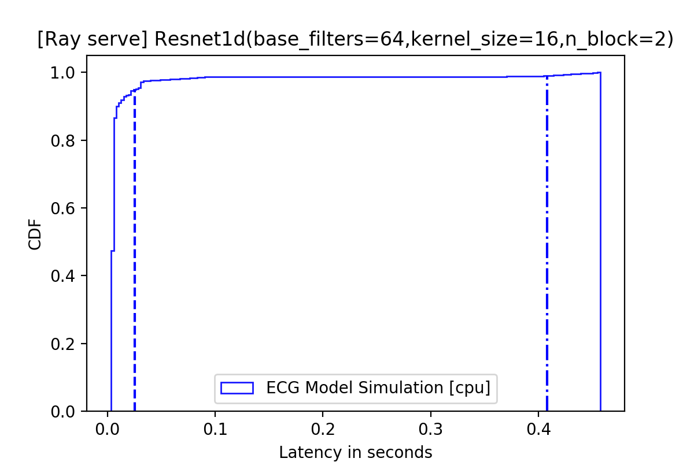
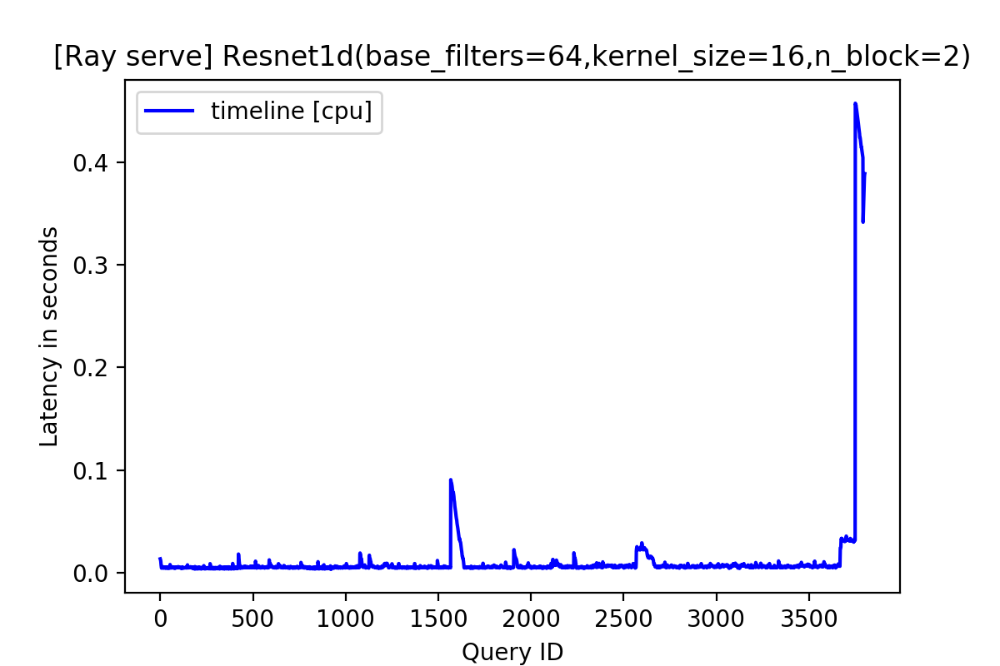

# serve-healthcare
### Create Conda Enviornment
1. `conda create -n serve-health python=3.6`
2. `conda activate serve-health`
3. `conda install -c pytorch pytorch`
4. `conda install -c pytorch torchvision`
### Install Golang
Installation details can be found [here](https://golang.org/doc/install). 
### Cloning the repository
`git clone --recurse-submodules https://github.com/alindkhare/serve-healthcare.git`
### Installing Ray
1. `cd serve-healthcare`
2. `bash ./ray/ci/travis/install-bazel.sh` 
3. `cd ./ray/python && pip install -e .[serve]  --verbose`
4. `cd ../../`
### Installing Python Packages
1. `pip install -r requirement.txt`
### Installing Profiling library library 
1. `pip install -e . --verbose`
### Running the profiling code
Running `python profile.py` populates `.jsonl` file for time taken by each query.
Using `.jsonl` file following can be plotted - 

### Create system based on configuration
The system is a special case of ML pipeline based on some multiple model library (V),
system constraints (C).
The system will then be configured to run an ensamble of model with Bagging strategy

To run the system try to call
`python run_config.py test`
### API call
If you want to use this code as part of another work you can use the api to generate
system based on Bagging strategy with specific system constraint

`import run_config.py`
`generate_bagging_system([pytorch_model_1, pytorch_model_2], {'gpu': 2, 'npatient':10})`

